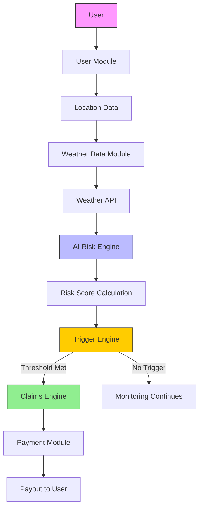

# 🧠 System Architecture — RainGuard AI

## 📦 Components

### 👤 User Module
- User registration  
- Policy selection based on risk  

---

### 🌦️ Weather Data Module
- Fetches real-time environmental data  
- Integrates with external APIs (e.g., OpenWeather API)  

---

### 🤖 AI Risk Engine
- Uses historical + real-time data  
- Calculates disruption probability  
- Generates risk score (0–1)  
- Dynamically adjusts premium  

---

### ⚡ Trigger Engine
- Monitors parametric thresholds:
  - Rainfall > 10 mm  
  - Temperature > 42°C  
  - AQI > 300  
- Activates payout condition automatically  

---

### 🧾 Claims Engine
- No manual claim process  
- Auto-validates trigger events  
- Initiates claim instantly  

---

### 💳 Payment Module
- Processes payouts (simulated / Razorpay test mode)  
- Ensures quick fund transfer  

---

## 🔄 Data Flow

User → Location  
↓  
Weather API → AI Risk Engine  
↓  
Trigger Engine  
↓  
Claims Engine  
↓  
Payment System  

---

## 📊 Architecture Diagram

___

## 🏗️ Architecture Overview

RainGuard AI follows a modern full-stack architecture designed for scalability, real-time processing, and automation.

- **Frontend:** React  
  - Handles user interaction, dashboard display, and policy selection  

- **Backend:** Node.js  
  - Manages business logic, APIs, trigger evaluation, and claim processing  

- **Database:** MongoDB  
  - Stores user data, policies, risk scores, and transaction history  

- **External APIs:** OpenWeather API  
  - Provides real-time weather and environmental data  

- **Payments:** Razorpay (Test Mode)  
  - Handles automated payout processing  

---

## 🎯 Key Design Principles

### ⚡ Real-Time Decision Making
- System continuously monitors environmental conditions  
- Instant trigger-based execution without delays  

---

### 🤖 AI-Driven Risk Assessment
- Uses historical + real-time data  
- Generates dynamic risk scores  
- Enables adaptive pricing model  

---

### 🔄 Fully Automated Workflow
- No manual claims required  
- End-to-end automation from detection → payout  

---

### 🔒 Fraud-Resistant Architecture
- GPS-based location validation  
- Weather API cross-verification  
- Duplicate claim prevention  

---

### 📈 Scalable Design
- Supports expansion across multiple cities  
- Modular components for easy scaling  

---

## 🚀 Future Enhancements

### 🧩 Microservices Architecture
- Split modules into independent services  
- Improves scalability and fault isolation  

---

### 📡 Real-Time Event Streaming (Kafka)
- Enables faster and more reliable data processing  
- Handles high-frequency weather updates  

---

### 🧠 Continuous ML Pipeline
- Model retraining using new data  
- Improves prediction accuracy over time  

---

### 🛡️ Advanced Fraud Detection
- Behavioral analysis using ML  
- Detect suspicious patterns and anomalies  

---

### 🗺️ Geo-Based Risk Heatmaps
- Visualize risk levels across regions  
- Helps optimize pricing and alerts  

---
